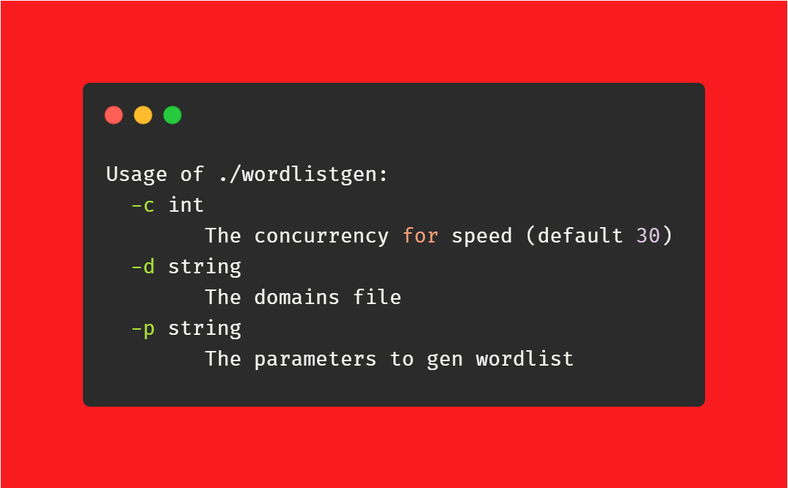
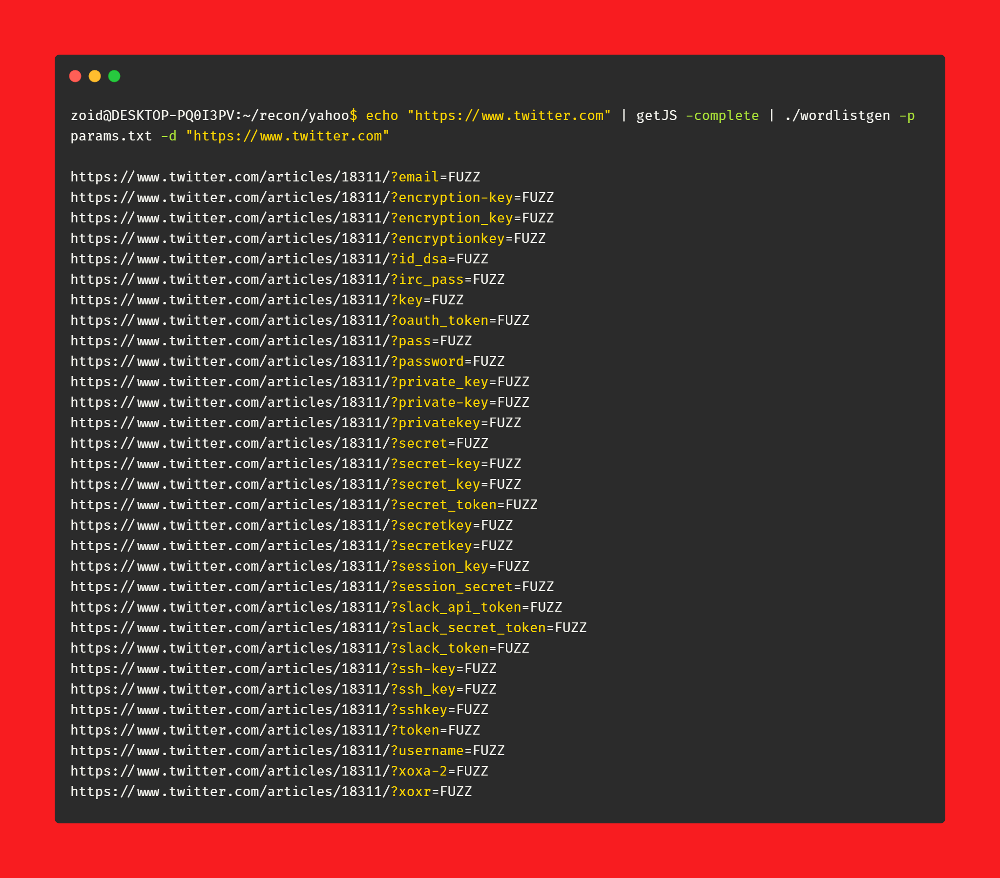

# wordlistgen
Generates target specific word lists for Fuzzing with fuff

**Version 1.0**

### Install

**`$ go get -u github.com/ethicalhackingplayground/wordlistgen`**

**`$ go get github.com/003random/getJS`**

### Generate wordlist
**`$ echo "https://www.twitter.com" | getJS -complete | ./wordlistgen -p params.txt -d "https://www.twitter.com"`**

The use ffuf

**Then get creative with FFuf**

**If you get a bounty please support by buying me a coffee**

 

